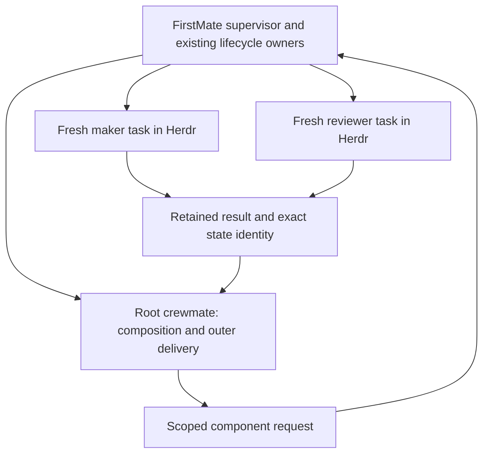

# Fundamental design: Orchflows for FirstMate running in Herdr

The dev.8 [bounded leaf-authoring extension](leaf-authoring.md) composes the
existing Work/Review interface to produce a complete non-delegating leaf or
guidance library, trial its exact joined source in a fresh component, retain
committed evidence and deliver through local-only owners. Its
[verification](leaf-authoring-verification.md) separates source, fixtures and
actual workers. General composing Build, nesting and portability remain open.

The dev.7 [local delivery extension](local-delivery.md) adds explicitly selected
ordinary ship/local-only roots to the bounded dynamic profile, using FirstMate's
existing branch, merge and teardown owners. [Current verification](local-delivery-verification.md)
records its evidence. Other ship modes, nesting and broader authoring remain
open. Historical increment descriptions below do not override this current scope.

The dev.6 continuation extends this seam to bounded Linux dynamic composition;
see [dynamic contract](dynamic-composition.md) and [current verification](dynamic-verification.md).
Earlier one-component restrictions below describe the dev.5 baseline.

**Latest user clarification — September 14, 2026:** the desired product is a
plug-and-play FirstMate upgrade. Preserve Orchflows' Work/Review, dynamic and
custom/meta-workflow behavior while using FirstMate's existing execution,
subagent, communication, workspace, recovery and delivery systems. Claude/Codex
handling remains FirstMate's responsibility. The next step is to audit the
experimental adapter against those owners and wire normal skill/workflow
availability. Add only a source-backed missing integration capability.
This supersedes the earlier priority of broad harness/lifecycle engineering and
any implication that every mechanism proposed below needs a new implementation.
See [current handoff](../HANDOFF.md) and D26 in [decisions](decisions.md).
The dev.5 continuation implements the [normal launch seam](normal-launch.md)
after the [owner audit](firstmate-owner-mapping.md); future composition work
must build on those FirstMate owners.

**Recommendation:** make this an independently distributed Orchflows fork whose compositions run inside a normal FirstMate root crewmate. Replace native-child creation in `orch-work` and `orch-review` with **FirstMate-owned component tasks in Herdr**. FirstMate owns every endpoint and lifecycle operation; the crewmate still chooses the workflow, makes authorized direct changes, joins results, and reports the outer deliverable. This needs a supported FirstMate task-group integration, not just plugin installation.

The user has authorized beginning modifications and clarified **FirstMate/Herdr only**. Claude Code and Codex CLI are worker harnesses under that fleet, not additional direct execution modes. The earlier research-only boundary and recommendation to leave native primitives unchanged are superseded for this fork. The original dated assessment remains evidence of the earlier investigation.

This document records the selected overall design. Stage 0 implemented the independent package, namespace and home. The subsequent [Stage 1 contract](stage1-contract.md) defines the experimental one-component implementation and its narrower acceptance; it supersedes the original missing-adapter gate for that operation only. The [Review contract](review-contract.md) extends admission to a standalone explicitly authorized Linux audit in dev.4. Broader feature parity and production compatibility remain unverified. Runtime evidence is recorded separately from this design.

## Current development platform

The user's September 14 direction is **Ubuntu in WSL, Linux first**. Perform development, candidate preparation, tests and worker trials with native Linux tools. Keep disposable candidates and homes on the Linux filesystem; the shared checkout remains the edit source. Native Windows lifecycle work is deferred and does not block the Linux implementation. The earlier Windows observations and refusal guards remain valid, but do not determine the current queue. See [Linux development](linux-development.md).

## Baseline and evidence

The user confirmed on September 14, 2026 that this fork should adapt the latest public `DanMcInerney/orchflows`. The owned package is now dev.5 at source target `ca72258493480ddcfe73b3f01d0475ad532e4726`, upstream version 0.7.0. Its added experimental `design-loop` library is retained as inactive migration source and was not used to perform this work, as requested. The table below preserves the historical Stage 1 baseline. [Refresh verification](upstream-refresh-verification.md) records the changed package separately; earlier trial identities remain unchanged.

| Input | Exact identity | What it establishes |
| --- | --- | --- |
| Orchflows source | [`0fc6cb7ac7da7b275a83cc90807fba15b8ceb15a`](https://github.com/DanMcInerney/orchflows/tree/0fc6cb7ac7da7b275a83cc90807fba15b8ceb15a), manifest 0.7.0 | Five core skills, instruction-based composition, complete package/CLI/history features and example libraries. Full clean research copy at `.sources/orchflows/`. |
| FirstMate source | [`b182d0f908b78d08c7ccb8dce3775bdca8c5d657`](https://github.com/kunchenguid/firstmate/tree/b182d0f908b78d08c7ccb8dce3775bdca8c5d657) | Existing supervisors, ship/scout workers, launch/control/brief owners, Herdr adapter and delivery contracts. Full clean research copy at `.sources/firstmate/`. |
| Local investigation | [Evidence](evidence.md), [FirstMate contracts](firstmate-contracts.md), [Orchflows contracts](orchflows-contracts.md) | Source inspection and earlier packaging checks; no live integration certification. Upstream claims and executed local checks remain distinct. |

These revisions identify the first implementation comparison. The source refresh has its own [candidate identity](upstream-refresh-state.json). Exact Herdr, Claude and Codex runtime versions/configuration must be recorded for live trials; the source pins do not establish that runtime tuple.

## Why change the primitive boundary

The preceding narrow library recommendation optimized for minimal FirstMate changes. The new product requirement prioritizes nearly complete Orchflows behavior under a single fleet owner. That changes the tradeoff.

| Architecture | Advantages | Principal cost or gap | Decision |
| --- | --- | --- | --- |
| Ordinary crewmate plus native children | Smallest attachment; preserves existing Work/Review wording | Two layers of task identity and control; actual worker-native capabilities and child recovery remain unverified; native children do not become FirstMate endpoints merely because the parent uses Herdr | Retain as research comparison, exclude from this product's execution contract |
| Root crewmate plus FirstMate component tasks | Uniform Claude/Codex routing, individual fleet records and Herdr endpoints, one lifecycle owner, natural exact result and restart boundaries | Requires new FirstMate component-task and parent/child contracts; changes the host implementation of Work/Review | **Recommended target** |
| Native children for small work, fleet children for durable work | Potentially lower startup cost | Two control, budget, cancellation, history and recovery semantics; implicit routing could change a workflow's guarantees | Reject for initial architecture; no native fallback |
| FirstMate supervisor executes every composition itself | Reuses fleet dispatch directly | Project analysis and direct edits conflict with the supervisor role; a delegated composed workflow still needs a representation | Reject as the general execution location |
| One nested secondmate per composition | Durable homes and existing reconciliation | Current secondmates do not spawn secondmates; persistent supervisor homes are not fresh maker/reviewer work contexts | Reject as the primitive mapping |
| Guidance-only distribution | Very small integration | Drops Work/Review and dependent behavior, so does not meet requested feature parity | Not the target |

Orchflows currently delegates only through Work/Review; loading another skill alone creates no agent. Preserve that distinction. A normal FirstMate crewmate may perform its assigned project work, while the primary and secondmates retain their supervisory role. FirstMate's source explicitly separates these roles and limits secondmate nesting. [Orchflows architecture](https://github.com/DanMcInerney/orchflows/blob/0fc6cb7ac7da7b275a83cc90807fba15b8ceb15a/docs/architecture.md), [FirstMate supervisor and secondmate contracts](https://github.com/kunchenguid/firstmate/blob/b182d0f908b78d08c7ccb8dce3775bdca8c5d657/AGENTS.md).

## Ownership and execution contract

This is a logical ownership diagram. The request and result interface is implemented only by this repository's experimental FirstMate patch for the Stage 1 subset; the pinned upstream does not supply it. Herdr placement may show separate presentation workspaces and must not determine the logical parent/child relationship.

| Owner | Responsibility |
| --- | --- |
| Orchflows root crewmate | Interpret the assigned workflow; preserve request context; choose ready assignments; request Work/Review; perform authorized direct work; join and integrate; retain evidence; respond to FirstMate steering; complete outer delivery |
| Orchflows component crewmate | Produce one requested result or review one exact candidate; optionally compose further work when its assignment allows; return findings, artifacts and gaps to its logical parent |
| FirstMate | Admit requests; own task IDs, role overlays, actual launch, quotas, worktree allocation, status, inboxes, lifecycle, generation checks, task-group records and delivery gates |
| Herdr through FirstMate's adapter | Terminal transport, endpoint facts and supported lifecycle primitives |
| Claude Code / Codex CLI | Execute each assigned agent session; expose the tools required by that assignment |
| Fork package | Supply skills, guidance, deterministic request/result helpers, source-preserving packaging, library resolution and history interpretation; no background scheduler |

Work/Review return an opaque FirstMate component handle plus the expected result location. Deferred gathering, sending steering, waiting, continuation and stopping resolve that handle through FirstMate. A shell script helper may expose this interface but cannot independently launch a harness or call Herdr. The existing FirstMate lifecycle owner must publish the task and accept the request under its normal ownership/locking rules.

A root request and its children form a logical task group within the **same owning FirstMate home**. Store parent edges separately from physical workspace layout. A component that composes another workflow may request grandchildren through the same interface, subject to the root's remaining bounds. It does not become a secondmate or gain broad fleet authority. Loading a leaf skill in the caller still creates no new task until Work/Review is invoked. Assignments saying “work without children” retain that restriction.

The initial interface needs a narrow component role and a component result disposition. Do not pretend existing `scout` completion or `local-only` delivery already means “return to parent.” A component must never open a PR, merge, start no-mistakes, close the root's decision or mark the root complete merely because its local assignment finished. Reuse ordinary FirstMate endpoint, workspace and status mechanics behind the explicit component role; decide the exact metadata field names in that change's design.

The root may write its assigned candidate directly where the workflow permits. Child makers write isolated candidates or explicitly owned output locations. The supervisor never integrates project edits itself. FirstMate-mediated requests are an operational ownership boundary under the existing trusted local account, not a claim of a new adversarial security sandbox.

## Fundamental changes

### 1. Separate distribution and home without losing the source

Maintain the full fork at `packages/orchflows-firstmate/`, with upstream identity, licenses, tests, scripts, guidance and every example preserved. Distinguish the fork package/catalog/CLI/home from normal Orchflows. Installing or updating the fork must not replace ordinary Orchflows or change its Claude/Codex concurrency settings.

Keep logical dependency resolution compatible where useful: an existing example's logical `orchflows` dependency may alias to the fork **inside its isolated resolver**. It must not resolve through a bare installed skill name to normal `orchflows` or `orchflows-light`. Resolve exact complete package roots from the task attachment and pass them through composed calls. Native plugin discovery is an optional convenience inside FirstMate-launched sessions, not an alternative execution host or the authority for dependency selection.

Record each deliberate divergence from the copied upstream. Avoid broad prose replacement that changes historical reports, trial outcomes or external URLs. Existing setup, validation, library creation, guidance resolution and history parsing should be preserved until a specific architectural replacement is justified. The current upstream package's complete shipped entries and relative resource links make a skills-only copy insufficient. [Package and home contracts](orchflows-contracts.md#package-identity-paths-and-discovery).

### 2. Change Work/Review execution, preserve their useful promises

`orch-work` requests one fresh FirstMate component agent with the assignment, input state, authorized workspace, resolved Make guidance and scoped controls. `orch-review` requests one fresh component agent that did not make the candidate, applies Review guidance, and neither makes nor delegates repairs. Neither silently falls back to host-native children or direct execution when the integration is missing.

The components use ordinary Claude/Codex CLI processes in recorded Herdr endpoints. Freshness means a new assignment session with no reused maker identity for its reviewer. The FirstMate handle includes enough incarnation identity to prevent a restarted task from being mistaken for the original running process. Continuation for repairs is allowed only if FirstMate can honor the repair assignment's current controls; otherwise create a fresh maker with explicit repair context. These retain the intent of [Work](https://github.com/DanMcInerney/orchflows/blob/0fc6cb7ac7da7b275a83cc90807fba15b8ceb15a/skills/orch-work/SKILL.md), [Review](https://github.com/DanMcInerney/orchflows/blob/0fc6cb7ac7da7b275a83cc90807fba15b8ceb15a/skills/orch-review/SKILL.md) and [model precedence](https://github.com/DanMcInerney/orchflows/blob/0fc6cb7ac7da7b275a83cc90807fba15b8ceb15a/docs/architecture.md#model-and-effort) while replacing native execution.

### 3. Add a small FirstMate task-group interface

The interface needs five operations: submit an assignment, inspect/gather its outcome, steer or continue it, request interruption/termination, and reconcile a saved group after relaunch. Use the current task launch/control/send owners. Integrate request handling into FirstMate's existing supervision mechanism; do not install an Orchflows daemon or another polling scheduler.

For each request persist: root and parent task identities, parent incarnation and assignment epoch, stable request ID, primitive type, selected entrypoint and bundle digest, input-state manifest, workspace/output requirements, requested harness/model/effort, review authorization, depth/concurrency bounds, and intended result schema. A retried request with the same identity returns the recorded result or child; a changed request body cannot reuse that identity silently.

Admission verifies the request against the current parent record and root policy before launch. It rejects stale parents, disallowed nesting, missing packages, incompatible controls and exceeded capacity. Keep an atomic acceptance record linked to the child launch transaction so a lost reply cannot create a duplicate child. Partial launches and uncertain endpoint state remain visible and recoverable through FirstMate.

Add a group-aware waiting state owned by FirstMate. A root awaiting an active component has unfinished work; it is neither done nor an external `paused:` wait awaiting a person. Supervision reconciles the named pending children and wakes the root on their result/failure, instead of classifying the quiet root as stale or launching a replacement merely because its pane is idle. Lost roots, lost children, missing results and unknown endpoint states remain separate recovery cases. Capacity accounting must also avoid letting waiting coordinators consume every available slot while their required children cannot start.

This is not currently supplied by process-event extension bindings, unknown metadata preservation or a shell wrapper around `fm-spawn.sh`. The supported seam needs explicit owner changes. [Existing extension scope](https://github.com/kunchenguid/firstmate/blob/b182d0f908b78d08c7ccb8dce3775bdca8c5d657/docs/extension-bindings.md), [metadata publication and replay findings](firstmate-contracts.md#durable-task-metadata-a-seam-with-limits).

### 4. Make review and outer delivery explicit

Preserve the dynamic workflow's one independent review and one repair pass without another review. Do not remove that review to make an incompatible FirstMate delivery policy appear supported. Likewise preserve explicit repeated reviews in workflows such as Evolve; those are declared composition behavior, not accidental additional gates.

FirstMate's current policy gives the selected delivery path its rigor, with separate review permitted only as an explicitly requested deliverable. The fork therefore needs a supported, recorded review-policy choice at task intake. [Current delivery policy](https://github.com/kunchenguid/firstmate/blob/b182d0f908b78d08c7ccb8dce3775bdca8c5d657/AGENTS.md#selected-delivery-path-and-merge-authority).

| Selected task contract | Proposed behavior |
| --- | --- |
| Explicit knowledge-only review | Run the requested Review composition; root retains the report and follows the existing scout completion gate |
| Workflow-owned review with direct-PR or local-only delivery | An explicitly enabled FirstMate profile authorizes that workflow's declared review/repair count; final delivery and merge authority remain FirstMate's |
| No-mistakes with its ordinary delivery-owned review | Use a separately named work-only composition. Selecting a workflow whose required review conflicts must refuse before work, not rewrite that workflow |
| No-mistakes plus explicitly requested separate audit | Record the separate scope and extra cost; complete and stop component writers before validation; identify the earlier reviewed state and do not claim it covers later pipeline changes |

Enabling workflow-owned review by a profile is a **proposed FirstMate policy change**, not a capability already authorized by its pinned source. Installation alone does not grant this policy. An unsupported combination must be diagnosed at task selection.

Only the root completes the existing outer delivery stages. In particular, no-mistakes implementation completion and CI-ready completion remain distinct. No component completion may trigger either automatically. Once no-mistakes takes branch custody, the workflow has no active writer or overlapping repair pass. [Definitions of done and validation custody](firstmate-contracts.md#q08-steering-decisions-and-delivery-mapping).

### 5. Preserve exact state, steering and recovery

Store a durable attachment before initial launch and regenerate the effective overlay from it on every relaunch. Preserve the captain's intent separately from implementation instructions. The attachment records the selected workflow, complete package graph, task role, delivery/review policy and accepted assignment epoch. Generated launch prose is never the sole stored input.

The root checkpoint records only composition state: phase, accepted steering, pending requests/joins, result references, candidate identity and unresolved decisions. FirstMate records agent/task state. Do not duplicate a fleet registry inside each workflow. Before acknowledging a steer, persist the changed assignment and propagate it to affected components or stop them; reject affected late results from the old epoch. Route component questions through their parent to the existing FirstMate decision owner with stable correlation keys.

Relaunch reconciles existing FirstMate children before any replacement submission. A stopped root does not imply stopped children. Unknown liveness blocks duplicate work. A resumed root may gather a demonstrated-live component or use its retained terminal result. Process exit, semantic completion and accepted result are three different facts.

Promotion is a task-stage transition, with an explicit replacement workflow/policy and accepted ship intent. Persist that transition before steering the worker so a later relaunch cannot replay obsolete scout instructions as current work. Until tested, reject promotion of an active workflow task and use a separately authorized ship task consuming its retained report. [Promotion and lifecycle evidence](firstmate-contracts.md).

### 6. Reuse Herdr's exact endpoint lifecycle

Use FirstMate's recorded `backend`, `window`, `herdr_session`, `herdr_workspace_id`, `herdr_tab_id` and `herdr_pane_id`; its adapter splits `window` on the first colon because the pane ID itself contains a colon. Route commands through the adapter's selected named-session client. Do not infer endpoints from labels, the focused workspace, a presentation token, a transcript or environment variables alone. [Herdr endpoint and transport contract](https://github.com/kunchenguid/firstmate/blob/b182d0f908b78d08c7ccb8dce3775bdca8c5d657/docs/herdr-backend.md#endpoint-metadata).

Herdr server restart preserves endpoint identifiers but not running harness processes. The adapter's liveness proof combines process state and registration; unknown process data refuses lifecycle operations. Native idle state does not prove that a foreground tool stopped. Push events shorten latency while FirstMate polling remains the fallback. These are source/documentation findings, not our observed runtime result. [Restart, liveness and events](https://github.com/kunchenguid/firstmate/blob/b182d0f908b78d08c7ccb8dce3775bdca8c5d657/docs/herdr-backend.md#restart-and-liveness-behavior).

A compatibility record must name the tested client, server, protocol, operating system, harness versions and configuration. Do not equate the documented protocol floor with proof of every process-response shape. Herdr presentation ordering is optional and must not become a task correctness dependency. Verify exact disappearance before removing child records; preserve uncertain work and endpoints through FirstMate's existing control/teardown owners.

### 7. Preserve workspace isolation, output retention and history

FirstMate allocates component workspaces from explicit starting-state identities. A commit is insufficient when relevant dirty or untracked inputs exist; transfer and hash those inputs explicitly. Each writer has one owner. The root integrates returned candidates in its own authorized worktree, resolves conflicts, freezes the joined result and sends that exact state to Review. Subsequent edits invalidate review coverage for the changed state.

Text research results may be retained in a standalone root scout report. Media, datasets and editable projects require a retained artifact destination and complete manifest, or a ship task whose repository contains the deliverable. A report link into a disposable child worktree is insufficient. Workflow authoring and self-improvement produce reviewable source packages in assigned workspaces; deployment into a live package home is a separate explicitly selected delivery operation. [Workspace and retention findings](firstmate-contracts.md#q09-and-q14-exact-results-and-non-code-retention).

Before component teardown, collect and verify all required candidate files and result artifacts in an authorized retained destination. An authorized root or integration worker imports the child result; the FirstMate supervisor does not edit the project to perform that integration. Retention and import are separate successful steps, and child cleanup cannot erase the only copy between them.

Keep native history readers for Claude/Codex transcripts, including their unavailable-data and pagination behavior. Add a FirstMate group index mapping root/component/attempt IDs to actual native session IDs and retained results. Fleet components will be separate native roots; reconstruct the logical group from the FirstMate index, not fabricated transcript ancestry. Never select “the newest session.” Retain needed evidence before normal teardown removes temporary state. History remains read-only evidence and never establishes current liveness. [Upstream history contract](https://github.com/DanMcInerney/orchflows/blob/0fc6cb7ac7da7b275a83cc90807fba15b8ceb15a/docs/history.md).

### 8. Pin packages and honor controls throughout the group

Freeze complete core and library resources by content identity for each run. Preserve library order and dotted-guidance specificity. New task defaults may advance to a new bundle; existing and resumable tasks retain the old complete graph. Stage, validate, activate and roll back the default atomically; remove packages only after no retained task references them. Initially support an explicit curated dependency inventory because existing library dependencies are prose, not a complete machine-resolved graph. [Dependency and upgrade evidence](orchflows-contracts.md#freezing-a-tasks-entire-input-package).

Carry caller model and effort choices independently through every assignment and repair, preserving existing precedence. Resolve actual harness launch controls through FirstMate after worker routing. Record requested and demonstrated effective values separately. Unsupported combinations, changed host configuration and missing runtime tools block the affected assignment instead of silently substituting defaults.

FirstMate owns aggregate active-agent capacity across the whole group and fleet. Orchflows declares composition counts and caller bounds; task children cannot multiply a hidden native limit. Start with one component at a time, then test parallel independent assignments and grandchildren. Default native-host concurrency changes are unnecessary for this architecture. Remote secondmates require independently provisioned bundles and tested host-local paths; inherited config alone does not provision a host.

### 9. Keep authentication with its owning host

Authentication belongs to the selected native harness profile, not the immutable Orchflows package, component request or result. Preserve the provider's refreshed credential store across its intended lifetime; do not create a fresh refresh-token owner by repeatedly copying an old cache into disposable worker homes. The continuation's copied Codex cache failed with an already-used refresh token. Official Codex automation guidance requires retaining the refreshed cache and a single machine or serialized stream for that automation copy. It does not justify duplicating the seed across hosts or concurrent jobs. [Official account-authentication guidance](https://learn.chatgpt.com/docs/auth/ci-cd-auth).

For bounded isolated Claude acceptance, the documented `CLAUDE_CODE_OAUTH_TOKEN` interface allows an access token held in the private process environment, with no refresh token copied and enough verified remaining lifetime for the trial. Expiry stops the trial; no silent refresh or profile rewrite occurs. This test arrangement is separate from a production authentication policy. [Claude environment contract](https://code.claude.com/docs/en/env-vars).

The release profile must declare the owning host store, its lifecycle and supported refresh/concurrency behavior. FirstMate supplies that profile through its existing launch owner. Workflow state retains only non-secret profile identity and readiness evidence. Native Windows readiness also depends on actual endpoint and process ownership, not merely authenticated CLI status; the [Windows acceptance record](stage1-windows-native.md) defines the required changes.

## Feature parity target

The complete source copy is the preservation baseline, not evidence that every feature already runs. Track byte-level retained artifacts separately from behavior adapted and behavior actually exercised.

| Feature family | Preserve | Required revision or acceptance gate |
| --- | --- | --- |
| `orch-work` | Fresh maker, Make guidance, scoped controls, explicit input/output state | FirstMate component submission, handle, join and continuation |
| `orch-review` | Fresh independent reviewer, exact candidate, no repairs | Read-only component role, maker/reviewer identity checks, retained findings |
| `orch-dynamic-workflow` | Caller composition, direct clear work where allowed, concurrent independent makers, one final review, one repair pass | Explicit review policy, scoped component handles, integration and delivery boundary |
| `orch-build-workflow` | Workflow/guidance/library authoring, representative trial before final review, declared dependencies and saved preferences | FirstMate-owned disposable trial scope and staged package output; no implicit live-home edits |
| `orch-self-improve` | Selected history inspection, report-only mode, source check, bounded Make/Review trial | Group history index across separate native sessions and permitted source/output roots |
| CLI and libraries | Setup/doctor/resolve/library mechanics, complete resource links, user-library preservation, guidance specificity | Separate namespace/home/catalog, retained bundle activation and group-aware history |
| Evolve | Bounded and continuous resumable search, tournaments, immutable incumbents/candidates, evaluation/harness versioning | FirstMate component handles and recovery; group budgets and retained run state; no independent wake daemon or invented background continuation |
| Social-search and research-acquire | Flat N-maker/one-reviewer composition, deferred gathering, partial gaps, bounded source acquisition | FirstMate handles and scoped deadlines; provider/runtime capabilities stay explicit |
| Short-video | One maker and one reviewer per film, editable project and exact exports, no implied extra stages | Durable multi-file artifacts and actual rendering/inspection tools in the selected worker |
| 3d-browser-game and other supplied examples | Existing composition, scripts, assets, guidance and trial material | Explicit child workspace/port/browser/runtime requirements; exercise representative behavior before claiming support |
| Custom and nested workflows | Current-context composition, dependency extension, explicit child bounds | Logical nested requests within one owning home; no recursive secondmate/native fallback |

Example-specific source contracts are preserved at the pinned [Evolve](https://github.com/DanMcInerney/orchflows/tree/0fc6cb7ac7da7b275a83cc90807fba15b8ceb15a/example-workflows/evolve), [social-search](https://github.com/DanMcInerney/orchflows/tree/0fc6cb7ac7da7b275a83cc90807fba15b8ceb15a/example-workflows/social-search), and [short-video](https://github.com/DanMcInerney/orchflows/tree/0fc6cb7ac7da7b275a83cc90807fba15b8ceb15a/example-workflows/short-video) packages. Translation should change their native-handle/host dependencies at the declared shared contract, while preserving agent counts and workflow decisions.

## Staged implementation and fixed acceptance

### Stage 0: independent source and installation foundation

This is the authorized starting increment for the current work. Its outcome is an editable, separately installable fork foundation with an explicit unimplemented execution boundary. It is not the minimum working integration PoC.

Required checks fixed for that increment:

1. Inventory the full upstream tree and record the source commit. Preserve all five core skills, examples, tests and notices; record deliberate fork substitutions.
2. Exercise setup/resolve and relevant existing package checks in disposable homes. Demonstrate that fork identity/home/catalog do not collide with normal Orchflows and user libraries survive repeated setup.
3. Verify no active normal Orchflows checkout, installed library/cache, host settings or live FirstMate state was modified by this increment.
4. All five supported core entrypoints identify the FirstMate/Herdr-only scope and refuse execution while the task-group integration is missing. Preserved examples remain inactive migration fixtures until ported and tested. A package check or environment marker cannot report operational compatibility.

### Stage 1: smallest actual end-to-end PoC

Use a dedicated Herdr lab session and disposable FirstMate home/project. Create a normal root scout with an explicit pinned package attachment and a small source-inspection assignment. The root invokes Work for **one read-only maker component**. The request passes through FirstMate, which launches a real component worker in its own recorded Herdr endpoint. The component returns a retained evidence result. The root verifies and incorporates it into its standalone report, then follows normal scout completion and cleanup.

The first worker tuple can be either Claude or Codex according to actual lab availability. Repeat the same fixture on the other harness before advertising both. The PoC does not depend on native subagent tools. It proves one useful complete path before building a broad installer, remote provisioning or every example.

The foundation inventory found no prepared native Herdr/FirstMate tuple on the inspected PATHs. Stage 1 subsequently staged exact dependencies in ignored storage and ran private WSL workers; [runtime preparation](stage1-runtime.md) and [native trial evidence](stage1-native-trial.md) record those later observations. This does not establish native Windows workers. Both research clones remain at the pinned revisions.

Required pre-implementation acceptance for Stage 1:

| Check | Shared fixture and expected baseline | Candidate pass condition |
| --- | --- | --- |
| Actual dispatch | Same pinned FirstMate, dedicated Herdr session and fixture repo. Unmodified FirstMate has no component request API; record that as a feature deficit, not a fabricated failure score | Exactly one new FirstMate component and exact recorded Herdr endpoint; fresh real harness process; no direct native child or direct Herdr spawn by Orchflows |
| Assignment and result | Ask the component to inspect a fixed source fixture and return two specified findings with file references into a retained result | Correct findings and evidence; selected package digest, parent/request identity, assignment epoch and actual worker identity accompany the result |
| Idempotent submission | Resubmit the same accepted request after simulating a lost reply | Returns the same component/result; changed body under the same request ID is refused |
| Scope and completion | Component is read-only, outer scout completion is held until gathered | No project write, PR, merge or no-mistakes action; component success does not complete root; root report survives normal cleanup |
| Failure | Missing integration, wrong backend, missing bundle, failed component, malformed result and unconfirmed endpoint are separate cases | Each is reported as missing/failed/unknown as appropriate; none becomes fallback execution or a successful complete report |
| Parent restart | Relaunch the root once after child acceptance using FirstMate's supported control owner | Replacement reads the same attachment and accepted request, reconciles the existing component/result, and does not submit a duplicate |
| Supervision while gathering | Keep the real component active long enough to cross an ordinary stale-worker observation interval | FirstMate reports the root's pending join and active component accurately; no false done, external pause or stale-root relaunch |
| Actual harness | Repeat identical assignment with recorded Claude and Codex profiles | Both runs supply real result and identity evidence; any untested tuple stays unsupported |

Collect exact source/candidate identities, command sequence, sanitized runtime configuration, request/response records, actual report and cleanup outcome. The native trial record establishes only its observed tuples and completed cases. Any unavailable or failed harness case remains unverified; mocked endpoint state cannot substitute for this acceptance.

### Stage 2: complete core primitives and delivery

Add a fresh reviewer of a frozen fixture, dynamic composition with exactly one review and repair pass, one isolated writer with root integration, and correct outer delivery mapping. Exercise steering during work/review; parent and child restart; unconfirmed interruption; effective model/effort choices; and artifact retention. Complete the relevant revised [P03–P08 and P12–P13 probes](experiment-plan.md), replacing native children with FirstMate components. Old probe assumptions are not silently inherited.

Required gates: a maker cannot review its own work; changed state cannot inherit a clean review; stale steering cannot produce the accepted current result; uncertain old writers cannot be replaced in a shared candidate; no child writes after validation custody starts; no-mistakes retains both distinct completion stages. Review-policy rejection must occur before incompatible work begins.

### Stage 3: nested composition and retained packages

Add a component invoking a composed workflow with a permitted grandchild, independent parallel work, bounded group-wide capacity, durable continuous-run checkpoints, complete bundle retention, install/update/rollback and promotion replay. Exercise failure after child acceptance but before reply, package-default changes during an active run, interrupted activation, same-version changed package bytes and rejection of a stale parent incarnation.

Run Build-workflow and Self-improve through representative trials with staged output and group-linked history. Validate all five core skills before calling the core port complete. Keep required FirstMate patches, fork changes and version requirements explicit rather than burying them in installation instructions.

### Stage 4: example parity and plug-and-play release

Use representative Evolve, social-search, short-video and 3d-browser-game fixtures with their real capability dependencies. Check editable artifacts and referenced assets after normal task teardown. Add remote secondmate provisioning only after an independently recorded remote worker tuple passes; optional tooling absence is a diagnosed capability gap, not a reason to omit the feature from the parity inventory.

Before release, one documented installation and enablement route must stage the complete fork, configure the supported FirstMate seam in a dedicated home, demonstrate both Claude and Codex worker readiness, explain required review policy, and leave normal Orchflows intact. Update/rollback must preserve active and resumable task bundles. Compare representative outputs and operator intervention against baseline FirstMate and the native-child research alternative under matched intent and delivery constraints; startup/cost differences need measurements, not claims from agent count.

## Remaining implementation decisions and blockers

The experimental Stage 1 controller now supplies a bounded request/result API and component role, with a disposable Herdr environment and separately recorded runtime trials. The remaining questions below guide extension beyond that subset; the implementation does not establish the broader compatibility target.

| Question | Resolution path |
| --- | --- |
| Can the owning FirstMate maintainers accept a task-group seam, or must we carry a pinned FirstMate patch? | Implement in an isolated FirstMate candidate and document the patch requirement; do not depend on unconfirmed upstream adoption |
| Which existing lifecycle transaction and supervision wake path should own request admission and result receipt? | Trace launch/control/inbox locks, select one owner, and test lost-response/duplicate-submit behavior before adding concurrent requests |
| Exact component workspace/result policy | Specify a dedicated role/disposition and retained report path for the read-only PoC; extend to isolated writable candidates only after ownership tests |
| Which Herdr runtime tuple is available and proves required process-state parsing? | Record installed client/server/protocol and run the lab fixture; source documentation alone does not settle it |
| Can stop/relaunch prove an old component writer is inactive? | Test actual process and endpoint behavior, including unknown states and detached tool activity; preserve unknown work and block overlapping replacement |
| How do harness background tools remain visible after a model turn ends? | A real Claude shell continued while FirstMate classified its component unknown. Define native background-tool activity and termination evidence at the existing FirstMate owner; a foreground-only watcher test does not resolve this gap |
| How much startup/resource overhead does a fresh fleet worker add? | Measure the same bounded assignments; only reconsider the selected architecture if overhead materially defeats the product and a tested alternative preserves its required semantics |
| How should new libraries declare complete dependency closure? | Start from explicit curated package lists, then add minimal declarative dependencies only when needed; do not build a workflow language |
| How is a requested nested/continuous workflow resumed automatically? | Use FirstMate's task/group reconciliation and existing supervision, with durable workflow checkpoints and original user bounds; no separate Orchflows wake service |
| Can historical transcripts survive the chosen cleanup/privacy policy? | Store exact session mapping and retain explicitly required evidence before teardown; report unavailable history without guessing |

The intended product preserves Orchflows' workflows and guidance while changing the execution host of its two primitives. Success means the same meaningful assignments, reviews, repairs, library features and example outcomes can be demonstrated under FirstMate's ownership, with every task visible and controlled through its recorded Herdr endpoint.
