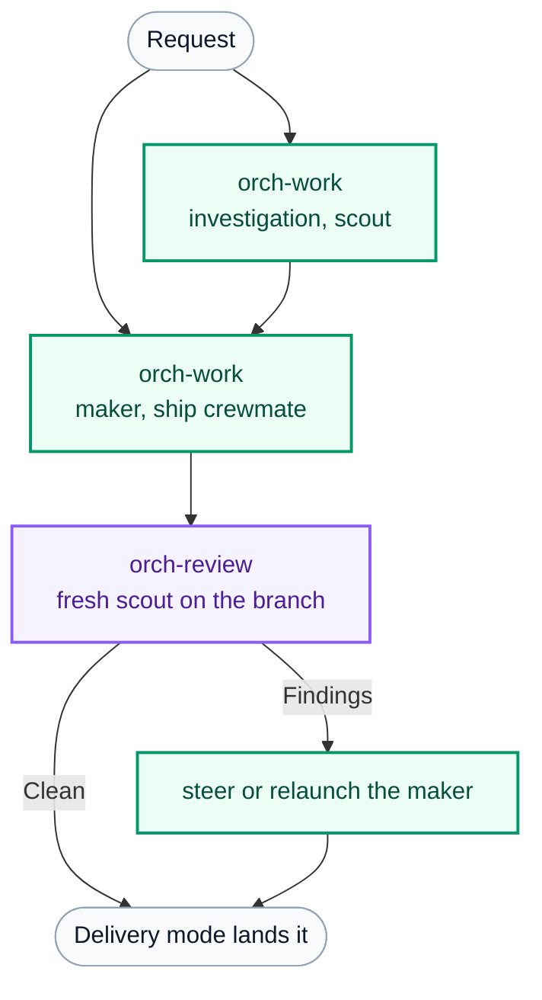

# orchflows-firstmate

**Orchflows' two skills, run by FirstMate's own agents.**

[**Work**](skills/orch-work/SKILL.md) makes a result. [**Review**](skills/orch-review/SKILL.md) independently judges it. Everything else is composition. The FirstMate primary session is the coordinator: every Work and Review is an ordinary FirstMate crewmate or scout with its own worktree, watcher, steering and delivery. Nothing in FirstMate is patched, and workers need no plugin.

## Why

Skill libraries grow around a model's current limitations, and the procedure they embed ages badly. Orchflows keeps two skills and moves everything else into workflows, which describe the relationships between making and reviewing, and guidance documents, which hold domain preferences and removable model corrections. A workflow is reusable because it names assignments and guidance, not a runtime.

FirstMate already owns the runtime: briefs, spawns, worktrees, supervision, steering, recovery and delivery. This library gives the first mate the pattern to use those owners well, so an ordinary request becomes fresh agents for the work and one fresh reviewer, with any model and effort per agent.

## Install

Requires Python 3.11+ and a FirstMate primary running on Claude Code or Codex.

```sh
cd packages/orchflows-firstmate
python scripts/orchflows.py setup
```

Then register the home with the primary's harness and install the package:

```sh
# Claude Code
claude plugin marketplace add ~/.orchflows-firstmate
claude plugin install orchflows-firstmate@orchflows-firstmate-home --scope user

# Codex
codex plugin marketplace add ~/.orchflows-firstmate
codex plugin add orchflows-firstmate@orchflows-firstmate-home
```

Append the Orchflows block to `$FM_HOME/data/captain.md`, optionally add the role rules to `$FM_HOME/config/crew-dispatch.json`, and start a new FirstMate session. [Full steps](docs/firstmate.md#install) · [Setup options](docs/home.md#setup) · [Registration](docs/hosts.md#register-and-refresh).

## Usage

Ask FirstMate for work. Unless you name a workflow, it runs [orch-dynamic-workflow](skills/orch-dynamic-workflow/SKILL.md): a fresh maker per landed change, one fresh reviewer, one repair pass, then the project's delivery mode.



**Models and effort.** Every agent is its own FirstMate spawn, so each can use any verified harness. Give Work and Review defaults in `crew-dispatch.json`, then override any named assignment in the request:

> Work: claude-sonnet-5 at xhigh. Review: claude-fable-5-1 at high. Final fixer: codex gpt-6-astra at xhigh.

Saved workflows keep such preferences beside their assignments when you ask them to. [Resolution order](docs/architecture.md#model-and-effort).

**Custom workflows.** Use [orch-build-workflow](skills/orch-build-workflow/SKILL.md) to turn a recurring request into a reusable workflow in `~/.orchflows-firstmate/libraries/`. It drafts the composition, has FirstMate run a real trial, and refines it before independent review. Only the dynamic workflow runs by description; Work, Review, build-workflow, the examples and your custom workflows are manual-only, so name them or invoke them by slash command. [Invocation policy](docs/hosts.md#invocation-policy).

## Design

- [Architecture](docs/architecture.md): the two primitives, where things live, model and effort, guidance selection.
- [FirstMate](docs/firstmate.md): how each step maps onto FirstMate commands, review placement per delivery mode, durable state.
- [Guidance](guidance/): domain preferences in `## Make` and `## Review`, extended by dotted specializations and your libraries.
- [Provenance](UPSTREAM.md): the upstream pin and every deliberate difference.

## Example workflows

The upstream example libraries are retained unchanged under `example-workflows/`: social-search, short-video, research-acquire, 3d-browser-game, design-loop, evolve, benchmaker, software-factory, export-workflow and self-improve. Add one with `python scripts/orchflows.py setup --example <name>` and install it through your host. They compose the same two primitives and should run through FirstMate as written, but none has been trialed there yet. Self-improve reads FirstMate's task records through this package's [history](docs/history.md).

## Tests

```sh
python -B -m unittest discover -s tests
```
