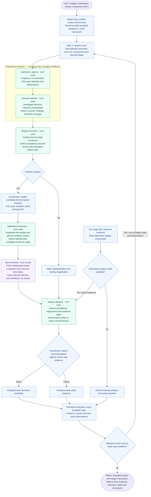

# Design loop

**Build the next version. Make it earn its place.**

Give Design loop an endgoal and a cycle count. It starts with the smallest useful working proof of concept, then uses each attempt's evidence to choose the next increment. Every candidate faces an independent comparison against the accepted version before it can become the new baseline.

**Endgoal → brainstorm + research → design → implement → test → analyze → repeat.**

Use it when you have a destination but want implementation choices to respond to what actually works: a new CLI, a prototype that needs another capability, or an existing project whose next increment needs research and testing. An unsuccessful candidate still leaves observations for the next cycle.

> **Experimental:** this packaged example has not been validated end to end in its standalone form. The bundled trials specify intended behavior; they are not completed tests.

## Try two cycles

After [installation](#install-and-dependencies), paste this into Codex:

```text
$design-loop:design-loop Build a local shopping-list CLI in this workspace.
It must add, list and remove items and persist them between commands.
Use Python's standard library. Run N=2 cycles, starting with the smallest
working PoC. Put the project, usage instructions, comparison evidence and
checkpoint in ./shopping-list-run/.
```

In Claude Code, use `/design-loop:design-loop` with the same request. Every skill in this library is manual-only by default.

Supply an endgoal, starting workspace or artifacts, and an output directory. You can also specify success criteria, constraints, task domains and scoped model/effort choices; unspecified model settings stay with the host. An empty workspace is valid. Existing uncommitted and relevant untracked work is preserved as part of the baseline.

## Why the loop is worth running

- **The first cycle has to build something useful.** Later cycles start from the last accepted version and the observations that led there.
- **The design sets the test before implementation.** Acceptance criteria, existing behavior to preserve and the old-versus-new comparison are fixed before the candidate is built.
- **The tester did not make the candidate.** It inspects the exact old and new states under comparable conditions, keeps raw evidence and makes no repairs.
- **A failed idea does not replace the accepted version.** Adoption requires supporting evidence; gaps and regressions produce a retain decision and inform the next attempt.

The coordinator calls small, reusable workflows. Each component can also run independently with the inputs described in its skill and the [shared handoff contract](references/design-loop-contract.md).

## Detailed flow



The failure branch applies to any failed stage; failures and skipped work remain visible in the checkpoint. Corrections belong to a later bounded cycle. A paused cycle resumes its first unfinished stage after validating recorded state identities and remaining bounds.

## Reusable workflows

| Workflow | Responsibility | Fresh children per call |
| --- | --- | --- |
| [design-loop](skills/design-loop/SKILL.md) | Coordinate bounded cycles, checkpoints and adoption decisions. | At most 6N through components |
| [brainstorm-research](skills/brainstorm-research/SKILL.md) | Compose brainstorming and research in sequence. | 2 through its leaves |
| [brainstorm-options](skills/brainstorm-options/SKILL.md) | Propose scoped increments and uncertainties. | 1 via `orch-work` |
| [research-options](skills/research-options/SKILL.md) | Investigate uncertainties and return decision evidence. | 1 via `orch-work` |
| [design-increment](skills/design-increment/SKILL.md) | Define scope, acceptance criteria and comparison plan. | 1 via `orch-work` |
| [implement-increment](skills/implement-increment/SKILL.md) | Build an isolated, reproducible candidate. | 1 via `orch-work` |
| [test-increment](skills/test-increment/SKILL.md) | Independently compare baseline and candidate without repairs. | 1 via `orch-review` |
| [analyze-iteration](skills/analyze-iteration/SKILL.md) | Recommend adopt/retain and inform the next brainstorm. | 1 via `orch-work` |

A full cycle uses six fresh children. Composers run in the caller and add none; there is no extra final review or hidden repair loop. `N` counts attempted cycles, including the first PoC and failed attempts, and defaults to 3. A run uses at most 6N child calls, including interrupted calls and replacements.

The loop runs through N unless the caller stops, a stated resource bound is reached, required capability or authorization is missing, or the caller explicitly chose stop-on-goal. Goal attainment alone does not shorten the run. Adoption requires evidence that the increment meets its acceptance criteria and preserves required existing behavior. Otherwise the accepted baseline remains in place, and the next brainstorm receives the observations.

Research defaults to at most three focused lookup/search operations and five relevant sources per invocation, starting with supplied or local material. The caller can change those bounds. A paused cycle resumes its first unfinished stage after checking state identities and remaining budget; resuming does not silently add attempts or child calls.

## What you get back

The final accepted project comes with usage instructions, an initial-to-final evidence summary, adopt/retain decisions, attempted and completed cycle counts, remaining gaps and a checkpoint path. Baselines, candidates and stage handoffs remain identifiable so the next cycle or resumed session can use the same evidence. Project artifacts and run records live in your workspace, outside the installed library.

## Install and dependencies

From a complete Orchflows checkout, using Python 3.11+:

```sh
python scripts/orchflows.py setup --example design-loop
```

Setup copies the example into the Orchflows home and preserves an existing library copy. Register and install `design-loop` from the resulting home catalog using core `docs/hosts.md`, then start a new host session. Setup alone does not make the skills available by name or install project tools.

- Orchflows core `orchflows` 0.7.0+ with `orch-work`, `orch-review` and a host supporting native child delegation.
- Task-specific tools for research, implementation, inspection and testing, plus reproducible state snapshots. The example bundles no project runtime or research service.
- This library's [design-iteration guidance](guidance/design-iteration.md), combined with caller-selected task domains as described in [library context](references/library-context.md).

## Evaluation status

The [portable trial request](trials/request.md) and [expected behavior](trials/expected-behavior.md) are specifications for future validation. Packaging and Markdown checks do not establish workflow behavior. Keep actual execution reports and project artifacts outside the installed library.
