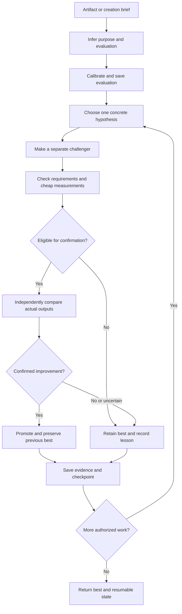
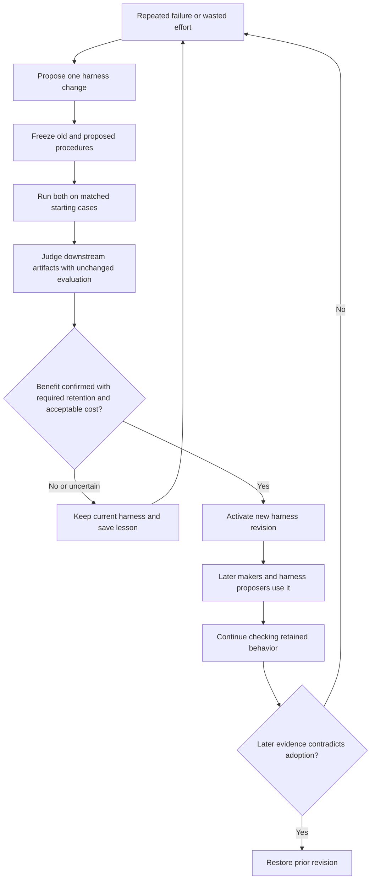

# Research behind Evolve

Research checked **September 13, 2026**. Evolve combines a small artifact-improvement loop with occasional experiments on the instructions and tools that perform the improvement. The research supports this architecture in particular settings. It does not establish universal artistic judgment, endless gains, or RSI Level 1 for this implementation.

This document consolidates the original research, inspection of earlier Orchflows implementations, and subsequent source verification. It distinguishes **published findings** and **our design choices**. Operating instructions live in the [workflow](skills/evolve/SKILL.md), [evaluation contract](skills/evolve/references/evaluation.md), and [state contract](skills/evolve/references/state.md).

## Scope and method

The original request was to rebuild `orch-evolve` for orchflows-light, with these requirements:

- Improve any artifact the host can create and inspect: code, designs, writing, generated media, prompts, or workflows.
- Allow user-supplied measurements, such as game FPS, without requiring a score, threshold, scoring script, or judging prompt from the user.
- Let the workflow infer and record suitable evaluation when none is supplied.
- Support repeated, resumable improvement, including changes to the improvement process itself.
- Keep tournaments optional and the implementation small.
- Examine Self-Harness, Weco's AIDE², SIA, Continual Harness, and relevant newer research.

We inspected those four systems in their latest primary versions visible on the research date, then expanded the search to harness retention, sustained artifact development, generated rubrics, judge reliability, and reflective prompt optimization. Sources are author papers and first-party reports. Version-pinned paper links identify the text used; publication and revision dates are separated below. Weco's articles are author reports, not independent replications.

This was a targeted design review, not a systematic literature review. We did not reproduce the cited benchmarks, audit every implementation dependency, or establish that no other relevant work exists. “Latest” means checked through the date above.

## What we learned from the original Orchflows library

The earlier implementation was inspected in local clones. These commit-pinned links identify the corresponding source snapshots; reading the local files did not require public availability of their GitHub remotes.

| Material inspected | What mattered for the rebuild |
| --- | --- |
| [Archived skill](https://github.com/DanMcInerney/orchflows-archive/blob/93f0248d4d7f3a889664e9ec43ab6e06aa1acca7/skills/workflows/orch-evolve/SKILL.md) and [composition](https://github.com/DanMcInerney/orchflows-archive/blob/93f0248d4d7f3a889664e9ec43ab6e06aa1acca7/compositions/evolve.md), July 18, 2026 snapshot | Explicit goals and bounds, stable evaluation, preservation checks, and re-scoring after benchmark changes. Its required target information and plateau stopping were too restrictive for the new request. |
| [Earlier skill](https://github.com/DanMcInerney/orchflows-archive/blob/ac95b5670c39c7977789fbe897a039fc0ca39490/skills/orch-evolve/SKILL.md), [judging](https://github.com/DanMcInerney/orchflows-archive/blob/ac95b5670c39c7977789fbe897a039fc0ca39490/skills/orch-evolve/references/judging.md), and [journal](https://github.com/DanMcInerney/orchflows-archive/blob/ac95b5670c39c7977789fbe897a039fc0ca39490/skills/orch-evolve/references/journal.md), July 14, 2026 snapshot | A larger tournament default, listwise Borda ranking, randomized presentation, tie handling, and durable records. Anonymous comparison and journals transfer well; fixed panels, ranking machinery, and mandatory human adoption do not need to be defaults. |
| [Later generation contract](https://github.com/DanMcInerney/orchflows/blob/dbfa899ed64f30294fbe9630a95345c8dec73a8f/example-workflows/references/evolve-generation.md), August 31, 2026 snapshot | Clear ownership of search state, reconciliation of unfinished work, and separation between candidates and the active controller. The new workflow preserves that separation while allowing a tested working-harness revision to become active. |

The implementation was written afresh around native `orch-work` and `orch-review`. It retains stable comparisons and recoverable evidence without transplanting the old orchestration machinery. A candidate can improve working instructions; it cannot grant itself control over evaluation, promotion, budgets, or checkpoint ownership.

## Primary research

### 1. Self-Harness: learn from failures and test the patch

**Hangfan Zhang et al., _Self-Harness: Harnesses That Improve Themselves_.** First submitted June 8, 2026; inspected **v3, August 20, 2026**. [Paper](https://arxiv.org/html/2606.09498v3), [version history](https://arxiv.org/abs/2606.09498).

The system keeps model weights fixed, examines verifier-grounded execution failures, proposes small harness patches, and evaluates them before adoption. Accepted harness versions participate in generating later patches. Results cover nine model–benchmark combinations across Terminal-Bench 2.0, SWE-bench Verified, and AppWorld, with final improvements reported on both evaluation splits in all nine combinations. Promotion checks gains without degradation across splits, and repeated evaluations address stochasticity. [Self-Harness v3](https://arxiv.org/abs/2606.09498v3).

The held-out split participates in promotion even though its traces are withheld from the proposer: it is validation, not a permanently untouched final audit. The Terminal-Bench subset excludes multimodal tasks. Our transfer is failure-led, minimal edits tested through downstream behavior; the paper does not validate arbitrary artwork optimization. [Methods and scope](https://arxiv.org/html/2606.09498v3).

### 2. AIDE²: search complexity has to earn its cost

**Weco Team, _AIDE²: The First Evidence of Recursive Self-Improvement_.** Author report, **July 14, 2026**. [Report](https://www.weco.ai/blog/first-evidence-of-recursive-self-improvement).

An inner loop improves code while an outer loop rewrites the research harness. Weco reports 100 outer iterations over eight days and seven improved agents under a fixed per-evaluation cost budget covering tokens and compute. The evolved approach combines exploration across lineages, greedy improvement within a lineage, and new strategies after stalls. Compact context averaged 16-fold compression against naive full-history concatenation. MCTS, island evolution, and pairwise LLM tournament proposals failed selection in this experiment. [AIDE² findings](https://www.weco.ai/blog/first-evidence-of-recursive-self-improvement).

Counterevidence matters: reported reward hacking fell from 63% to 34%, a statistical defense later broke, and evolved code became difficult to maintain. A separate “ignition” follow-up was insufficient to establish ignition; its efficiency difference was not statistically significant. That caveat concerns the follow-up, not every result in the report. [Limitations and follow-up](https://www.weco.ai/blog/first-evidence-of-recursive-self-improvement).

We therefore default to small comparisons and compact lessons. These results do not rule out tournaments for other tasks, especially subjective work.

### 3. SIA: choose the intervention from observed behavior

**Prannay Hebbar et al., _SIA: Self Improving AI with Harness & Weight Updates_.** First submitted May 26, 2026; inspected **v2, May 28, 2026**. [Paper](https://arxiv.org/html/2605.27276v2), [version history](https://arxiv.org/abs/2605.27276).

A feedback agent examines scaffold code, trajectories, and verifier results, then selects harness or weight updates. In v2 these actions can interleave; they are not mandatory sequential phases. The authors report that combined updates outperform scaffold-only updates on legal charge classification, GPU kernel optimization, and RNA denoising. [SIA v2](https://arxiv.org/abs/2605.27276v2).

The relevant lesson is to choose an intervention that explains an observed failure. The experiments supply verifiers, so they do not demonstrate inventing artistic preferences from an open-ended request. Evolve borrows feedback-driven harness changes without requiring model training, specialized hardware, or the SIA training infrastructure. [Method and task setup](https://arxiv.org/html/2605.27276v2).

### 4. Continual Harness: retain experience while acting

**Seth Karten et al., _Continual Harness: Online Adaptation for Self-Improving Foundation Agents_.** Inspected **v1, May 11, 2026**; no later revision was shown. [Paper](https://arxiv.org/html/2605.09998v1), [version history](https://arxiv.org/abs/2605.09998).

An agent alternates acting and refinement of prompts, skills, subagents, and memory while its environment continues. The refiner uses recent trajectory data; adaptation does not require restarting the environment. Pokémon Red and Emerald experiments show capability-dependent gains over a minimal harness. The paper distinguishes earlier human-assisted game completions from its automated refiner experiments. [Continual Harness](https://arxiv.org/abs/2605.09998v1).

This motivates retaining useful state and experience between bounded execution periods. Its optional weight co-learning extension is unnecessary for this library. Persistent operation in a game does not establish endless gains, general artistic evaluation, or reliability of arbitrary live edits. Our checkpoints and controlled adoption are implementation choices for preserving continuity across host interruptions. [Framework and experiments](https://arxiv.org/html/2605.09998v1).

### 5. Harness Continual Learning: new capabilities can break old ones

**Borui Kang et al., _Harness Continual Learning: Continual Adaptation Beyond Model Parameters_.** Inspected **v1, August 19, 2026**. [Paper](https://arxiv.org/html/2608.19013v1), [version history](https://arxiv.org/abs/2608.19013).

Even with fixed model weights, changes to prompts, tools, memory, and routing can impair previously successful behavior. The framework separates candidate generation from commitment and checks current adaptation, historical retention, and validity under matched conditions. Text, multimodal, and interactive experiments expose a tradeoff between adapting and retaining prior capabilities. [Harness Continual Learning](https://arxiv.org/abs/2608.19013v1).

This supports keeping a compact set of earlier cases when testing harness changes. Evolve tests a known failure, a prior success, and a fresh case before admitting a procedure change. That three-case starting set is our lightweight design, not a claim of statistical sufficiency or a reproduction of the paper's full architecture. [Method and evidence](https://arxiv.org/html/2608.19013v1).

### 6. Harness-of-Harness: durable evidence supports long development runs

**Haoyang Yan et al., _Harness-of-Harness: Multi-Day Autonomous Software Development with Continual Improvement_.** Inspected **v1, September 1, 2026**. [Paper](https://arxiv.org/html/2609.01481v1), [version history](https://arxiv.org/abs/2609.01481).

Planning, implementation, and independent testing carry artifacts and evidence between iterations. Evaluation criteria come from the specification and current development objective. The paper reports a game-development run exceeding 70 iterations. [Harness-of-Harness](https://arxiv.org/abs/2609.01481v1).

Its model, base harness, roles, and runtime policy remain fixed within a run. It demonstrates sustained artifact development, not recursively changing that harness. Main benchmark comparisons also give iterative development more passes, so they cannot establish matched-cost RSI. We borrow durable evidence and verification of actual outputs; we do not count the reported iteration length as proof of harness self-improvement. [Methods and comparison design](https://arxiv.org/html/2609.01481v1).

### 7. GenRubric: evaluation criteria can be generated

**Yifan Chen et al., _GenRubric: Self-Evolving Rubric Generation for Scalable LLM Evaluation_.** Inspected **v1, August 30, 2026**. [Paper](https://arxiv.org/html/2608.29856v1), [version history](https://arxiv.org/abs/2608.29856).

GenRubric learns to produce query-specific rubrics using unlabeled queries and cross-rubric signals. The method includes reinforcement learning; it is more than asking an unchanged model for a rubric. The authors report improved agreement against expert-generated rubrics and transfer to held-out domains. [GenRubric](https://arxiv.org/abs/2608.29856v1).

This motivates making inferred criteria explicit and inspectable. Evolve asks the coordinator to derive criteria from the request and artifact, without importing the training method. The paper does not establish that one spontaneously generated rubric captures every user's preferences or provides an objective ordering of artworks. Generated evaluation is a useful hypothesis that needs calibration and remains open to user correction. [Approach and evaluation](https://arxiv.org/html/2608.29856v1).

### 8. Judge reliability: a written rubric is not enough

**Anshul Bagaria et al., _Judging LLM-as-a-Judge: Concerning Rubric Artifacts in LLM-based Automated Text Generation Evaluation_.** Submitted **August 31, 2026**, inspected **v1**. [Paper](https://arxiv.org/html/2609.02942v1), [version history](https://arxiv.org/abs/2609.02942).

Rubric-only classifiers predict nontrivial portions of judge outputs without seeing the evaluated response. Counterfactual changes to responses or criteria do not reliably change judgments. This challenges the assumption that supplying explicit criteria is sufficient to make scoring respond to actual output quality. [Judge-reliability findings](https://arxiv.org/abs/2609.02942v1).

Our response is to calibrate against an obvious defect, require artifact-specific evidence, conceal candidate origins, and confirm subjective winners with reversed presentation order. These are design precautions, not a cure demonstrated by this paper. Its experiments concern text evaluation; applying such checks to visual work is an extrapolation, and multiple LLM judgments can share the same biases. [Experimental scope](https://arxiv.org/html/2609.02942v1).

### 9. GEPA: preserve explanations and useful alternatives

**Lakshya A. Agrawal et al., _GEPA: Reflective Prompt Evolution Can Outperform Reinforcement Learning_.** First submitted July 25, 2025; inspected **v2, February 14, 2026**, listed as an ICLR 2026 oral. [Paper and metadata](https://arxiv.org/abs/2507.19457v2).

GEPA uses natural-language reflection on execution traces to diagnose failures and propose prompt changes. It retains complementary candidates through Pareto-based selection, rather than discarding every option that is not the current overall winner. Its evidence concerns prompt systems, including code optimization. [GEPA v2](https://arxiv.org/abs/2507.19457v2).

Evolve borrows brief explanatory lessons and a small archive of meaningfully different alternatives. A useful failure record says what was tried, what happened, and what it suggests trying next. This does not require installing GEPA, maintaining a full Pareto population, or sending every earlier transcript to every maker. Transfer to other artifact types is our design inference.

## How the research shaped the workflow

The following choices are our synthesis, not a single published algorithm. Exact defaults—three rounds when unspecified, one challenger, and a change of approach after three nonpromotions—are practical starting points, not research-derived optima.

| Design choice | Research connection | Implementation |
| --- | --- | --- |
| Generate evaluation when absent | GenRubric motivates explicit criteria; judge-reliability work makes calibration necessary | [Evaluation design](skills/evolve/references/evaluation.md) |
| Inspect the actual artifact and retain evidence | Verifier-grounded harness research and independent artifact testing | [Evaluation and promotion](skills/evolve/references/evaluation.md) |
| Start with one challenger; widen when justified | AIDE² challenges assumed benefits of complex search; GEPA motivates retaining distinct alternatives | [Search loop](skills/evolve/SKILL.md) |
| Keep evaluation stable within a comparison | Self-Harness and retention research motivate comparable, regression-aware decisions | [Evaluation versions](skills/evolve/references/evaluation.md) |
| Test a harness by the work it produces | Self-Harness and SIA motivate behavior-led procedure changes | [Harness experiments](skills/evolve/SKILL.md) |
| Preserve earlier successes and compact lessons | Harness Continual Learning, GEPA, and AIDE² | [Evaluation](skills/evolve/references/evaluation.md) and [state](skills/evolve/references/state.md) |
| Resume from durable identities and decisions | Continual Harness motivates continuity; earlier Orchflows contracts and Harness-of-Harness inform evidence persistence | [Checkpoints and recovery](skills/evolve/references/state.md) |

### Evaluation for anything the host can inspect

For runnable code, the coordinator can write correctness checks and a scoring script. An FPS request might combine frame-time measurements with gameplay preservation. A speed gain that breaks behavior is ineligible.

For a poster, the coordinator can infer audience, message, required facts, readability, and visual coherence. It saves a judging prompt before candidate creation. Judges inspect actual renders, explain relevant differences, and return a preference, tie, or uncertainty. There is no need to invent a scalar “art score.” Mixed evaluation can combine deterministic fact checks with aesthetic judgment.

Calibration asks whether evaluation notices a clear defect or meaningful contrast. It cannot prove taste alignment. Explicit user preferences remain authoritative, and inferred preferences are revisable. A broken evaluator is repaired between experiments: record a new version and re-score the incumbent and relevant alternatives. Scores from different versions are not directly comparable, and easier criteria do not count as artifact improvement.

Fresh judges receive task-only context and anonymous artifact paths. Reversed-order confirmation reduces one source of fragility; it does not make judges independent in a statistical sense. Shared filesystem access is not an enforced secrecy boundary. Once confirmation examples influence future proposals, they become regression examples rather than untouched test data.

### Improving the improver without a second framework

A harness experiment replaces an ordinary artifact round. It tests one change to a prompt, context selection, tool, verification practice, or search policy. The coordinator reserves comparison cases before the proposer sees their specifics, runs old and new procedures from the same starting points, and evaluates their resulting artifacts under unchanged criteria and matched work allowances.

A better-looking instruction document is not enough. The change must improve downstream work. The active working harness can evolve; the rules governing user intent, evaluation, promotion, budgets, and state ownership remain outside candidate authority. This separation is a procedural contract followed by the coordinating agent, not a new sandbox or deterministic enforcement runtime.

### Simplicity and continuation

We did not import mandatory Borda panels, a large search tree, island populations, model-weight training, or an additional scheduler. Wider search is available when useful. Confirmation follows cheap screening so obviously ineligible candidates do not consume expensive judging work.

A plateau triggers a different hypothesis, a distinct archived approach, or a harness experiment. It does not silently lower standards or declare a continuous request complete. Each decision saves artifact identities, evaluator and harness versions, evidence, lessons, remaining bounds, and child handles. On resume, the coordinator reconciles the journal and checkpoint before dispatching work. Unknown child liveness prevents blindly duplicating that work.

“Forever” means the campaign has no preset total cap when explicitly requested and can continue through saved state. The host must keep executing or resume it; Markdown does not wake itself. Runtime limits, exhausted resources, user stops, and lack of achievable gains remain real constraints.

## RSI Level 1: what is and is not established

**Weco Team, _4 Levels of Recursive Self-Improvement_, July 10, 2026**, supplies the taxonomy used here. It is an author-defined framework, not a universal certification. Level 1 requires outperforming humans improving the same system with ordinary AI assistance, supported by a fair baseline, sustained multistep progress, generalization, and fixed physical budgets. Level 2 adds evidence that the improved system is itself a better improver; Level 3 concerns accelerating returns. Merely editing a harness does not establish these performance levels. [Weco's RSI ladder](https://www.weco.ai/blog/4-levels-of-recursive-self-improvement).

Weco presents AIDE² as evidence for its claim. We did not independently reproduce that experiment. The other sources were mined for relevant mechanisms; they are not all being labeled RSI Level 1 systems.

For this workflow, an eventual test should compare a fixed starting system, its evolving version, and a strong human-assisted baseline on the same task distribution. Our proposed protocol would:

1. Fix model settings and account for the whole campaign: proposals, failed trials, judges, retries, tools, and evaluation overhead.
2. Match resource budgets and report both outcome quality and cost, with enough repetitions to expose variability.
3. Separate development examples, retention cases, and a fresh final audit that does not feed selection.
4. Run several successive improvements and check whether benefits transfer to new tasks, not just repeated examples.
5. Test whether accepted harness revisions improve later improvement work, rather than merely producing one better artifact.

These are proposed future measurements. The current implementation has **not established RSI Level 1**.

## Validation

Reusable [trial requests](trials/) describe expected behavior. Record observed outcomes, source records and evidence gaps in the caller's workspace. Local run reports are not bundled with this library; the cited research does not establish this implementation's performance.
