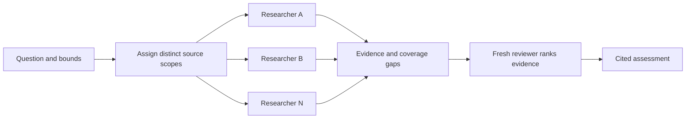

# Social Search

**One question. Parallel researchers. An answer you can trace.**

Give Social Search a question and the public sources you care about. Researchers collect distinct evidence in parallel, then a fresh reviewer ranks what actually supports the answer. You get a cited assessment, the source material behind it, and the gaps that still matter.

Use it to investigate a product's reception, compare developer experiences, or follow a research claim from its original paper into public discussion.

## Try it

After [installation](#install), paste this into your agent:

```text
Use social-search:social-search to investigate what developers report about
running SQLite in production. Search Hacker News, Reddit, and original
technical writeups from the last 30 days. Give shared original-source checks
one owner. Rank the strongest evidence, explain disagreements, and link the
inspected sources. Spend at most 20 minutes including review. Save the report
and collection evidence in research/sqlite-production.
```

Change the question, dates, sources, time limit, and output directory. Sources can be a site, a web scope, supplied feeds, or related sources grouped into one assignment.

## Why this is useful

- **Parallel coverage with clear ownership.** Researchers divide unmet scope. Shared originals get one owner, so overlapping discussions can reuse the same source check.
- **A fresh judgment.** The final reviewer reads the collected evidence and ranks its support, provenance, limitations, and independent corroboration.
- **Context survives collection.** Relevant dates, inspected excerpts, discussion context, and available engagement travel with each finding. Multiple posts citing one study remain one underlying study.
- **Gaps survive the summary.** Partial, blocked, and empty searches remain distinguishable. A failed source cannot silently become “nobody is talking about this.”

## How it works



**N collection assignments use N workers and one reviewer.** Collection runs through `search-site` → `orch-work`; assessment runs through `rank-evidence` → `orch-review`. The coordinator gathers every outcome before review. A total time limit includes collection, handoff, and assessment.

Already have evidence? Supply it and collect only what's missing, or invoke the assessment leaf directly. The reviewer assesses the supplied material without collecting more or changing it.

| Entrypoint | Use it for | Fresh children |
| --- | --- | --- |
| [social-search](skills/social-search/SKILL.md) | Collect and assess a bounded question | N workers + 1 reviewer |
| [search-site](skills/search-site/SKILL.md) | Collect one source assignment | 1 worker |
| [rank-evidence](skills/rank-evidence/SKILL.md) | Assess evidence you already have | 1 reviewer |

## What you get

A ranked, cited assessment plus a compact `results.md` per collection assignment, with links to supporting artifacts. Findings retain inspected support, original URLs, date qualifications, relevant engagement when available, and coverage limits. The [evidence contract](references/evidence.md) defines the handoff.

Reach and reliability are assessed separately. Sampled discussion can show what participants experienced; it cannot establish how common that experience is. Supplied sources and available access determine coverage.

## Install

From a complete Orchflows checkout with Python 3.11+:

```sh
python scripts/orchflows.py setup --example social-search
```

Register the home and install core plus `social-search` for your host using core's `docs/hosts.md`, then start a new session. Setup preserves existing user-owned library copies; apply example updates to that copy before refreshing an existing install.

All three skills are manual-only by default. Invoke `$social-search:social-search` in Codex or `/social-search:social-search` in Claude Code; substitute the leaf name to use it alone.

Requires Orchflows 0.7.0+, native child delegation, and public search/read tools. Optional `python scripts/orchflows.py setup --example research-acquire` adds acquisition tools and a YouTube transcript reader; install that library with your host too. It owns its dependencies and routes, and its generic feed support requires version 0.4.0+. Setup installs no library runtime dependencies.

## Make it yours

[Research guidance](guidance/research.search-site.md) sets collection and assessment criteria. Site specializations cover Reddit, Hacker News, GitHub, X, YouTube, web, feeds, and Lemmy; unfamiliar sites use the general criteria with available tools. [Library context](references/library-context.md) connects guidance, dependencies, and output paths.

Trial specifications cover [sites](trials/request.md), [web/feeds/Lemmy](trials/web-feeds-lemmy/request.md), and [papers/discussion](trials/papers-and-discussion/request.md). They describe requests and expected behavior, not observed results.

Adapted from [orchflows recent-search](https://github.com/DanMcInerney/orchflows/tree/945546721732aa564a086ee9543803b38017e1c3/example-workflows/recent-search) under the retained [MIT license](LICENSE).
